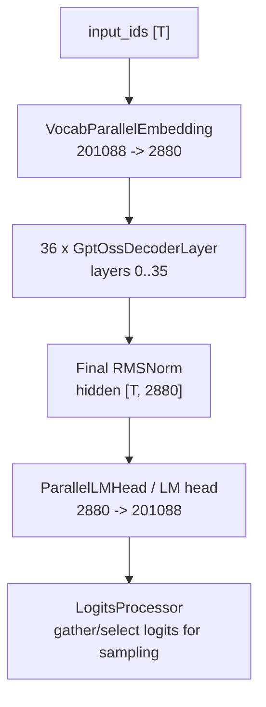
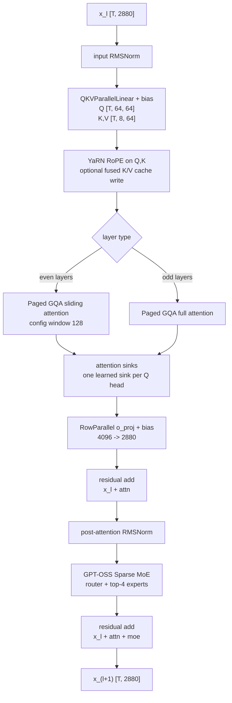
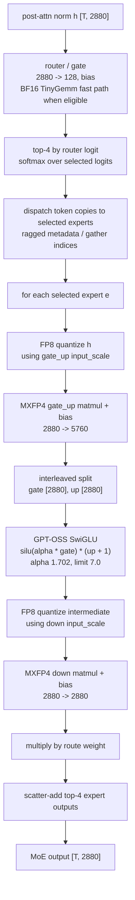

# GPT-OSS 120B MXFP4/FP8 Graph

This page sketches the inference graph for
`amd/gpt-oss-120b-w-mxfp4-a-fp8` as implemented by TokenSpeed's
`GptOssForCausalLM` path.

Sources:

- Hugging Face config:
  `https://huggingface.co/amd/gpt-oss-120b-w-mxfp4-a-fp8/blob/main/config.json`
- Hugging Face model card:
  `https://huggingface.co/amd/gpt-oss-120b-w-mxfp4-a-fp8`
- TokenSpeed implementation:
  `python/tokenspeed/runtime/models/gpt_oss.py`

## Model Constants

| Field | Value |
|---|---:|
| Architecture | `GptOssForCausalLM` |
| Vocabulary | 201088 |
| Hidden size | 2880 |
| Decoder layers | 36 |
| Query heads | 64 |
| KV heads | 8 |
| Head dim | 64 |
| QKV projection width | 5120 = 4096 Q + 512 K + 512 V |
| Experts per layer | 128 |
| Experts per token | 4 |
| Expert intermediate size | 2880 |
| RMSNorm epsilon | `1e-5` |
| RoPE | YaRN, theta 150000, factor 32, original context 4096 |
| Max positions | 131072 |
| Attention pattern | layers 0,2,... use sliding attention; layers 1,3,... use full attention |
| Sliding window | config value 128; TokenSpeed uses 127 internally because its window is exclusive |
| Quantization | AMD Quark; expert weights FP4/MXFP4 group 32 with E8M0 scales; expert inputs FP8 E4M3 |
| Quantization exclusions | self-attention projections, router, and LM head |

## Causal-LM Graph

`T` is the active token count for the current prefill/decode step. Tensor and
expert parallel sharding changes local shapes, but the logical graph is:



The TokenSpeed layer compiler can insert all-reduce, reduce-scatter, all-gather,
or fused reduce-plus-RMSNorm ops between these nodes depending on the configured
attention TP, dense TP, MoE TP, and expert parallel placement.

## Decoder Layer

Each layer is a pre-norm attention block followed by a pre-norm routed MoE block:



Attention is grouped-query attention: 64 query heads share 8 KV heads, so each KV
head serves 8 query heads. RoPE is applied over the full 64-d head dimension.
`PagedAttention` owns the paged KV cache update/read path; TokenSpeed passes the
learned attention sinks into that attention kernel.

## Routed Expert Graph

The router and experts operate on the post-attention normalized hidden states:



The AMD checkpoint stores one tensor group per expert:

```text
model.layers.<l>.mlp.experts.<e>.gate_up_proj.{weight,weight_scale,bias,input_scale}
model.layers.<l>.mlp.experts.<e>.down_proj.{weight,weight_scale,bias,input_scale}
```

TokenSpeed maps those tensors into fused MoE parameters:

| Checkpoint tensor | TokenSpeed parameter |
|---|---|
| `gate_up_proj.weight` | `w13_weight` |
| `gate_up_proj.weight_scale` | `w13_weight_scale` |
| `gate_up_proj.bias` | `w13_weight_bias` |
| `gate_up_proj.input_scale` | `w13_input_scale` / `w13_act_scale` |
| `down_proj.weight` | `w2_weight` |
| `down_proj.weight_scale` | `w2_weight_scale` |
| `down_proj.bias` | `w2_weight_bias` |
| `down_proj.input_scale` | `w2_input_scale` / `w2_act_scale` |

For the AMD Quark W4A8 path, the Triton MXFP4 backend quantizes the expert
input and intermediate activations to FP8 before the two expert GEMMs. The
logical top-4 combine is still weighted by the router softmax values.
