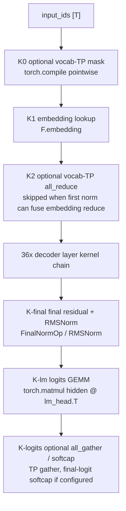
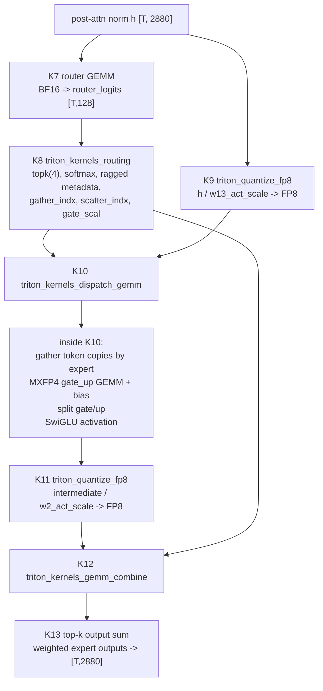

# GPT-OSS 120B MXFP4/FP8 Graph

This page sketches the inference graph for
`amd/gpt-oss-120b-w-mxfp4-a-fp8` as implemented by TokenSpeed's
`GptOssForCausalLM` path.

Sources:

- Hugging Face config:
  `https://huggingface.co/amd/gpt-oss-120b-w-mxfp4-a-fp8/blob/main/config.json`
- Hugging Face model card:
  `https://huggingface.co/amd/gpt-oss-120b-w-mxfp4-a-fp8`
- TokenSpeed implementation:
  `python/tokenspeed/runtime/models/gpt_oss.py`
- Relevant TokenSpeed runtime/kernel files:
  `python/tokenspeed/runtime/layers/linear.py`,
  `python/tokenspeed/runtime/layers/paged_attention.py`,
  `python/tokenspeed/runtime/layers/attention/backends/mha.py`,
  `python/tokenspeed/runtime/layers/moe/backends/mxfp4/triton_kernel.py`,
  `tokenspeed-kernel/python/tokenspeed_kernel/ops/embedding/__init__.py`,
  `tokenspeed-kernel/python/tokenspeed_kernel/ops/gemm/__init__.py`,
  `tokenspeed-kernel/python/tokenspeed_kernel/ops/moe/triton_kernels.py`

## Model Constants

| Field | Value |
|---|---:|
| Architecture | `GptOssForCausalLM` |
| Vocabulary | 201088 |
| Hidden size | 2880 |
| Decoder layers | 36 |
| Query heads | 64 |
| KV heads | 8 |
| Head dim | 64 |
| QKV projection width | 5120 = 4096 Q + 512 K + 512 V |
| Experts per layer | 128 |
| Experts per token | 4 |
| Expert intermediate size | 2880 |
| RMSNorm epsilon | `1e-5` |
| RoPE | YaRN, theta 150000, factor 32, original context 4096 |
| Max positions | 131072 |
| Attention pattern | layers 0,2,... use sliding attention; layers 1,3,... use full attention |
| Sliding window | config value 128; TokenSpeed uses 127 internally because its window is exclusive |
| Quantization | AMD Quark; expert weights FP4/MXFP4 group 32 with E8M0 scales; expert inputs FP8 E4M3 |
| Quantization exclusions | self-attention projections, router, and LM head |

## Kernel-Boundary Legend

`K*` nodes are GPU kernel or collective boundaries in the steady-state forward
path. `V*` nodes are cheap views/splits/metadata transitions that usually do not
launch a kernel by themselves.

The exact attention kernel depends on `--attention-backend` and prefill/decode
mode. The exact collective pattern depends on attention TP, dense TP, MoE TP,
expert parallelism, and whether compiler-inserted fused reduce-norm is enabled.

## Whole Forward Pass

`T` is the active local token count for the scheduler step. For decode, `T` is
usually one token per active sequence. For prefill/extend, `T` is the chunked
prefill token count.



GPT-OSS does not use TokenSpeed's Kimi-only fused LM-head kernel gate, so the
LM-head edge is a regular matmul in `LogitsProcessor._get_logits`.

## Per-Layer Kernel Graph

This is the logical per-layer order for `GptOssDecoderLayer`. The layer compiler
wraps these nodes with collectives when placement changes require them.

```mermaid
flowchart TD
  x["x_l [T, 2880]"]

  x --> n0["K1 RMSNorm or fused reduce+residual+RMSNorm<br/>RMSNorm.forward / FusedReduceNormOp"]
  n0 --> qkv["K2 QKV GEMM + bias<br/>tokenspeed_kernel.mm<br/>2880 -> q:4096 + k:512 + v:512"]
  qkv --> split["V1 split q,k,v<br/>q [T, 4096], k [T, 512], v [T, 512]"]
  split --> rope["K3 RoPE on q,k<br/>embedding.rope<br/>optional fused K-cache write and V-cache write"]
  rope --> viewkv["V2 reshape q,k,v<br/>Q [T, 64,64], K/V [T, 8,64]"]
  viewkv --> attn["K4 paged GQA attention<br/>backend kernel reads paged KV cache<br/>uses sinks and optional sliding window"]
  attn --> oproj["K5 O-proj GEMM + bias<br/>tokenspeed_kernel.mm<br/>4096 -> 2880"]
  oproj --> n1["K6 residual add + RMSNorm<br/>often fused with attn-TP reduction"]
  n1 --> router["K7 router GEMM + bias<br/>tinygemm_bf16 fast path or tokenspeed_kernel.mm<br/>2880 -> 128 logits"]
  router --> route["K8 MoE routing/topk/softmax<br/>moe_route: triton_kernels_routing"]
  route --> q1["K9 FP8 quantize expert input<br/>quantize_fp8, static input_scale"]
  q1 --> eg1["K10 dispatch + MXFP4 gate_up GEMM + bias + SwiGLU<br/>moe_experts: triton_kernels_dispatch_gemm<br/>2880 -> 2880 intermediate"]
  eg1 --> q2["K11 FP8 quantize expert intermediate<br/>quantize_fp8, static input_scale"]
  q2 --> eg2["K12 MXFP4 down GEMM + route weights + scatter<br/>moe_experts: triton_kernels_gemm_combine<br/>2880 -> top4 outputs"]
  eg2 --> sum["K13 top-4 sum/reduction<br/>out.view(T,4,H).sum(dim=1)"]
  sum --> outcomm["K14 optional MoE TP/EP collective<br/>all_reduce, reduce_scatter, or deferred reduce"]
  outcomm --> y["hidden for next layer input norm"]
```



Important residual detail: in the compiled path, the residual add after a compute
node is commonly consumed by the next RMSNorm kernel. For example, attention
output plus the pre-attention residual is folded into the post-attention
RMSNorm, and the MoE output plus residual is folded into the next layer's input
RMSNorm or the final norm.

## Operation Table

| Boundary | Simple operation | TokenSpeed implementation | Notes |
|---|---|---|---|
| K1 | RMSNorm, sometimes residual add | `RMSNorm.forward`; compiler may use `FusedReduceNormOp` | On AMD this calls Triton RMSNorm; with residual it is fused add+RMSNorm. |
| K2 | Dense GEMM, bias | `QKVParallelLinear` -> `tokenspeed_kernel.mm` | `Mxfp4Config` intentionally does not quantize dense linears; QKV is BF16. |
| V1 | Split | `qkv.split([q_size, kv_size, kv_size], dim=-1)` | View/slice boundary, not a math kernel. |
| K3 | RoPE, optional cache write | `tokenspeed_kernel.ops.embedding.apply_rope` | When the backend supports KV prewrite, this fuses RoPE with K/V cache writes. |
| K4 | Attention | `PagedAttention` -> active attention backend | GQA: 64 Q heads, 8 KV heads. Even layers pass sliding window 127; odd layers pass `-1`. |
| K5 | Dense GEMM, bias | `RowParallelLinear` -> `tokenspeed_kernel.mm` | `reduce_results=False`; any needed reduction is inserted by the compiler. |
| K6 | Residual add, RMSNorm, maybe reduction | `RMSNorm.forward` or `FusedReduceNormOp` | This is where the attention residual usually materializes. |
| K7 | Router GEMM, bias | `TinyGemmLinear` | Uses `tinygemm_bf16` when available for CUDA small batches; otherwise `tokenspeed_kernel.mm`. |
| K8 | Top-k routing and softmax | `moe_route(..., expected_kernel_name="triton_kernels_routing")` | In the AMD MXFP4 backend, `TopK` is bypassed and routing happens inside this backend kernel. |
| K9 | FP8 quantize | `tokenspeed_kernel.quantize_fp8(..., solution="triton")` | Static per-tensor scale from Quark `gate_up_proj.input_scale`. |
| K10 | Dispatch, GEMM, bias, activation | `moe_experts(..., features={"ragged_metadata", "dispatch_gemm"})` | MXFP4 gate/up matmul; fused activation is GPT-OSS SwiGLU: `silu(alpha * gate) * (up + 1)`. |
| K11 | FP8 quantize | `tokenspeed_kernel.quantize_fp8(..., solution="triton")` | Static per-tensor scale from Quark `down_proj.input_scale`. |
| K12 | GEMM, bias, route weighting, scatter | `moe_experts(..., features={"ragged_metadata", "gemm_combine"})` | MXFP4 down projection; `gammas` are route weights. |
| K13 | Top-4 combine reduction | `out.view(T, top_k, H).sum(dim=1)` | PyTorch reduction after `matmul_ogs` when `top_k > 1`. |
| K14 | Collective | compiler-inserted `AllReduceOp`, `ReduceScatterOp`, `AllGatherOp`, etc. | Present only when the configured parallel placement requires it. |

## Attention Kernel Choices

`GptOssAttention.forward_core` calls `PagedAttention`, which delegates to
`ctx.attn_backend`. For GPT-OSS' MHA/GQA architecture, the registered runtime
backend is `MHAAttnBackend`; the backend name (`mha`, `fa3`, `fa4`, `triton`,
or `flashinfer`) is passed as `solution` to the `tokenspeed_kernel` attention
APIs.

| Mode | Kernel boundary | Simple operations inside |
|---|---|---|
| Decode, one query token per request | `mha_decode_with_kvcache` | Read paged K/V cache, apply GQA attention, causal/sliding-window mask, sinks, softmax, and value accumulation. |
| Multi-token decode / target verify | `mha_extend_with_kvcache` | Same attention math as extend, using paged cache metadata. |
| Prefill without cached prefix | `mha_prefill` | Dense variable-length causal attention over new Q/K/V; then cache write when `save_kv_cache` is true. |
| Prefill with cached prefix | `mha_prefill` + `mha_extend_with_kvcache` + `mha_merge_state` | Attend to the new chunk and cached prefix separately, then merge output/LSE states. |

Attention metadata work such as page-table construction, KV-index construction,
`torch.cumsum`, and optional scheduler metadata runs once per scheduler step and
is reused by all layers. In decode, `MHAAttnBackend.support_kv_cache_prewrite`
allows the RoPE kernel to prewrite K/V cache; in prefill/extend the backend
performs cache writes around the attention call.

## AMD Quark MXFP4 Expert Path

For `amd/gpt-oss-120b-w-mxfp4-a-fp8`, TokenSpeed promotes the Quark checkpoint
to `Mxfp4Config`. Dense attention, router, embedding, and LM head remain BF16.
Only the MoE expert path uses the W4A8 MXFP4/FP8 kernels.



The `gate_up` rows are stored interleaved for GPT-OSS, so load-time processing
swizzles/transposes packed weights and scales into the layout consumed by the
Triton MXFP4 matmul kernels. That swizzle is not part of steady-state forward
execution.

The AMD checkpoint stores one tensor group per expert:

```text
model.layers.<l>.mlp.experts.<e>.gate_up_proj.{weight,weight_scale,bias,input_scale}
model.layers.<l>.mlp.experts.<e>.down_proj.{weight,weight_scale,bias,input_scale}
```

TokenSpeed maps those tensors into fused MoE parameters:

| Checkpoint tensor | TokenSpeed parameter |
|---|---|
| `gate_up_proj.weight` | `w13_weight` |
| `gate_up_proj.weight_scale` | `w13_weight_scale` |
| `gate_up_proj.bias` | `w13_weight_bias` |
| `gate_up_proj.input_scale` | `w13_input_scale` / `w13_act_scale` |
| `down_proj.weight` | `w2_weight` |
| `down_proj.weight_scale` | `w2_weight_scale` |
| `down_proj.bias` | `w2_weight_bias` |
| `down_proj.input_scale` | `w2_input_scale` / `w2_act_scale` |

For the AMD Quark W4A8 path, the Triton MXFP4 backend quantizes the expert
input and intermediate activations to FP8 before the two expert GEMMs. The
logical top-4 combine is still weighted by the router softmax values.
